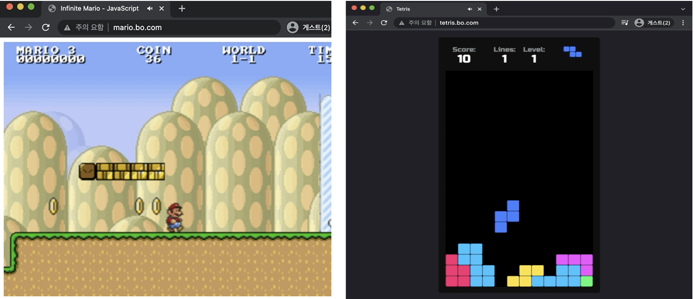
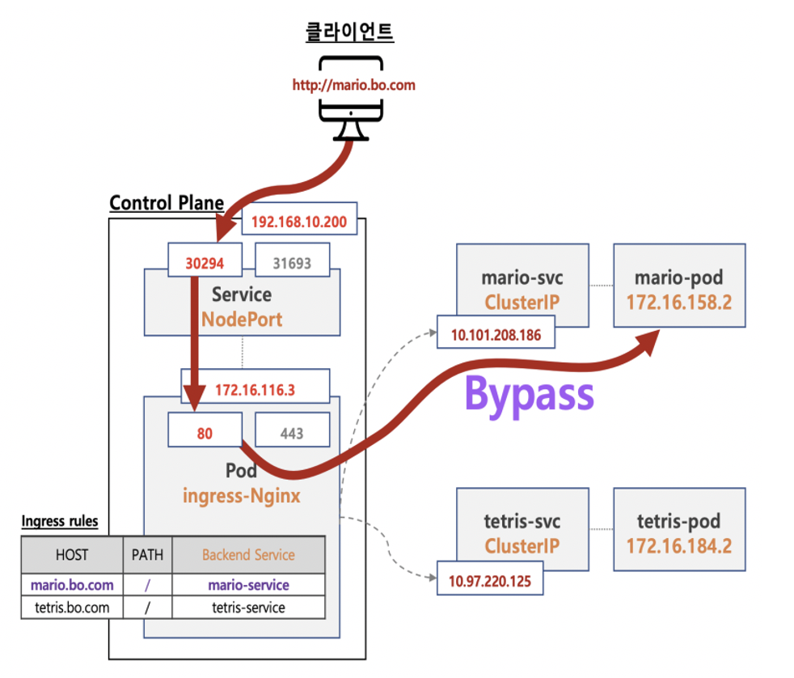

# Ingress 실습

 

## 동작
- 슈퍼 마리오 게임
    - 게임 시작 s  입력, 점프(s), 쏘기(a)
- 테트리스 게임
    - 화살표키, 일시중지(space bar)

 

## 통신 흐름

---

## 실습 구성
-  [metalLB 배포](metalLB_배포.md)
-  [Nginx Ingress Controller 배포](Nginx_Ingress_Controller_배포.md)
-  [mario 배포](mario_배포.md)
-  [tetris 배포](tetris_배포.md)
-  [Ingress(정책) 배포](ingress_rule_배포.md)
-  [접속 확인](접속_확인.md)