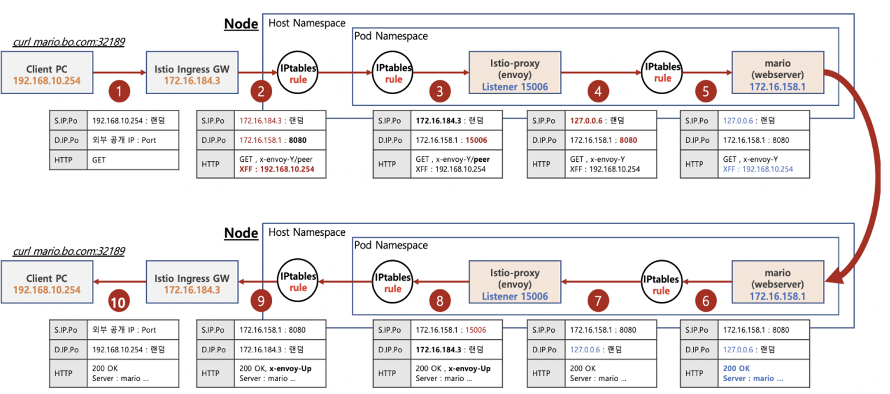

# Istio 실습

 

## 통신 흐름

---

## 실습 구성
-  [Istio 설치](Istio_설치.md)
-  [Istio 변수 지정](Istio_변수_지정.md)
-  [mario 배포](mario_배포.md)
-  [Istiogateway/virtualService 배포](Istio_gateway&virtualService_배포.md)
-  [접속 확인](접속_확인.md)

