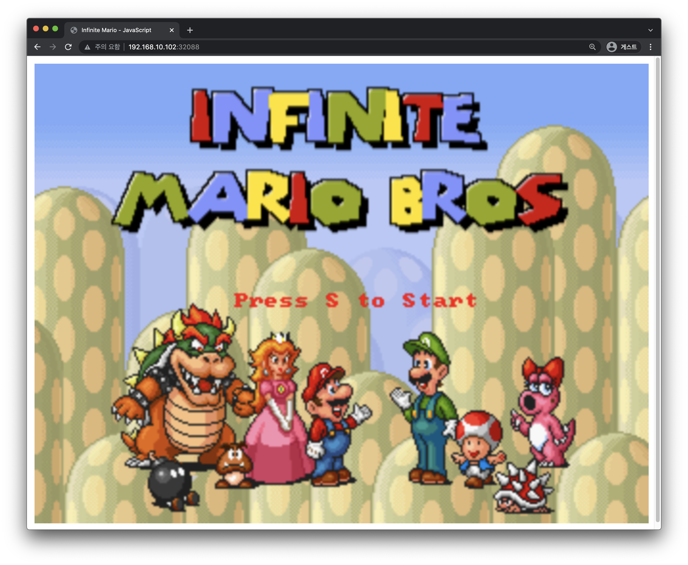
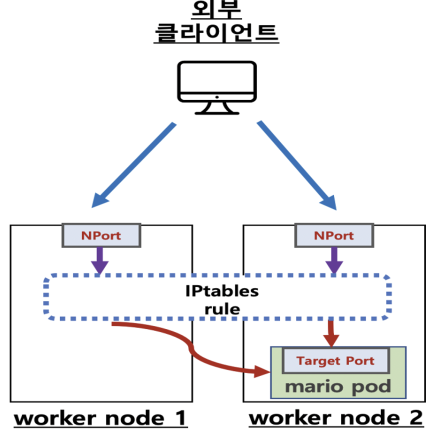

# NodePort 실습

 

## 동작
- 슈퍼 마리오 게임
    - 게임 시작 s  입력, 점프(s), 쏘기(a)

 

## 통신 흐름

---

## 실습 구성
-  [mario deployment와 service 배포](mario_배포.md)
-  [접속 확인](접속_확인.md)
-  [externalTrafficPolicy 설정](externalTrafficPolicy_설정.md)

