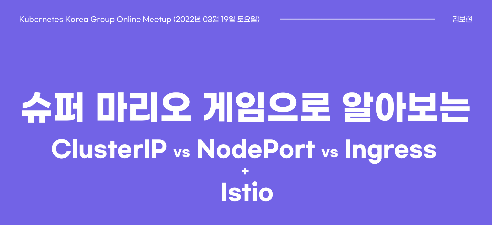

# mario-k8s-meetup

 

## 목적

 

발표 실습 자료를 공유합니다.  
pdf 자료는 [슈퍼 마리오 게임으로 알아보는 ClusterIP vs NodePort vs Ingress + Istio](https://www.slideshare.net/reumba/clusterip-vs-nodeport-vs-ingress-istio)를 클릭해주세요.

---

## 발표
- 주제: 슈퍼 마리오 게임으로 알아보는 ClusterIP vs NodePort vs Ingress + Istio
- 일시: 2022년 03월 19일 토요일 19시-21시
- 장소: [Kubernetes Korea Group 온라인 meet up](https://www.meetup.com/Cloud-Native-Computing-Seoul/events/284443282/)

---

## 목차
-  [실습 환경](./실습_환경/README.md)
-  [ClusterIP 실습](./ClusterIP_실습/README.md)
-  [NodePort 실습](./NodePort_실습/README.md)
-  [Ingress 실습](./Ingress_실습/README.md)
-  [Istio 실습](./Istio_실습/README.md)

