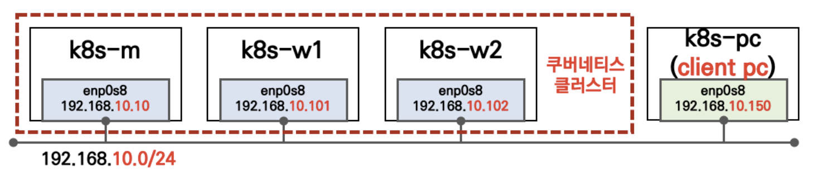

# 실습을 위한 K8S 설치
K8S 배포에 사용할 폴더(디렉터리)를 생성 후 사용해주세요.

<br />

## 구성도


<br />

```sh
# 전체 VM 배포
vagrant up

# 배포 확인
vagrant status

# Control Plane 접속
vagrant ssh k8s-m

# node 접속
vagrant ssh k8s-w1
vagrant ssh k8s-w2

# client pc 접속
vagrant ssh k8s-pc
```